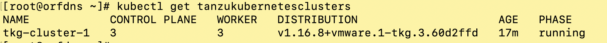
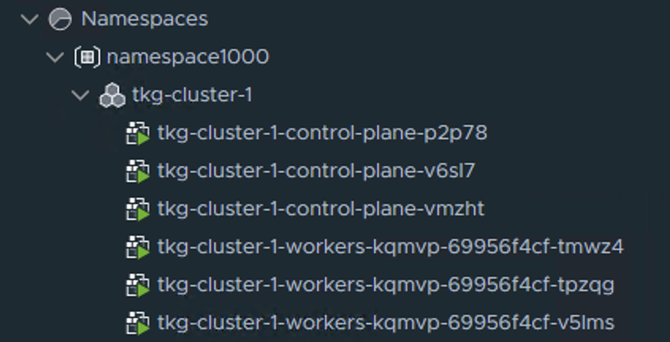

# Patching a TKG (guest cluster) in vSphere7 with Tanzu (Kubernetes) 

* This is an exampe of patching a Tanzu Kubernetes Grid (TKG / guest cluster) in vSphere 7 with Tanzu

* Create a TKG (version 1.68)

```
kubectl apply -f https://github.com/ogelbric/YAML/raw/master/TKG1001GA-3m-3w-1168.yaml
kubectl get tanzukubernetesclusters  

```

* This should be the result after a few minutes





* Check the content library for avaliabel versions

```
kubectl get virtualmachineimages
```


* Patching sequense

```
	read -r -d '' PATCH <<'EOF'
	spec:
	  distribution:
	    fullVersion: null
	    version: v1.17.7
	EOF

	kubectl patch --type=merge tanzukubernetescluster tkg-cluster-1 --patch "$PATCH"
```

* Random commands that helped in creating this write up

```
kubectl get tanzukubernetescluster,cluster-api,virtualmachinesetresourcepolicy,virtualmachineservice,virtualmachine

```
