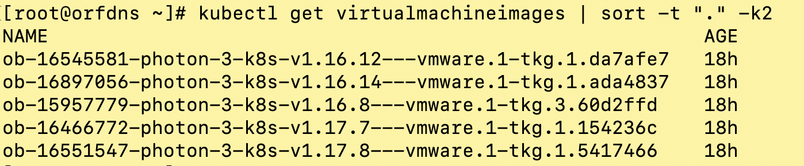
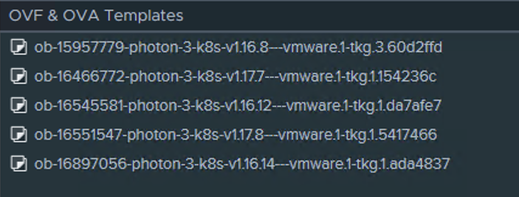

# Patching a TKG (guest cluster) in vSphere7 with Tanzu (Kubernetes) 

* This is an exampe of patching a Tanzu Kubernetes Grid (TKG / guest cluster) in vSphere 7 with Tanzu

* Create a TKG (version 1.68)

```
kubectl apply -f https://github.com/ogelbric/YAML/raw/master/TKG1001GA-3m-3w-1168.yaml
kubectl get tanzukubernetesclusters  

```

* This should be the result after a few minutes


* Check the content library for avaliabel versions

```
kubectl get virtualmachineimages | sort -t "." -k2
```




* Patching sequense (cut and paste the read...EOF into Linux command line)

```
read -r -d '' PATCH <<'EOF'
spec:
  distribution:
    fullVersion: null
    version: v1.16.12
EOF

echo $PATCH

kubectl patch --type=merge tanzukubernetescluster tkg-cluster-1 --patch "$PATCH"

```

* Commands to monitor deployment

```
kubectl get virtualmachine,tanzukubernetesclusters
kubectl describe  tanzukubernetescluster tkg-cluster-1
kubectl describe virtualmachine
watch "kubectl describe virtualmachine | grep -i image"

```

* Observe the first new worker deployed


* Versions of the control plane VM's and the worker VM's


* Random commands that helped in creating this write up

```
kubectl get tanzukubernetescluster,cluster-api,virtualmachinesetresourcepolicy,virtualmachineservice,virtualmachine

```
